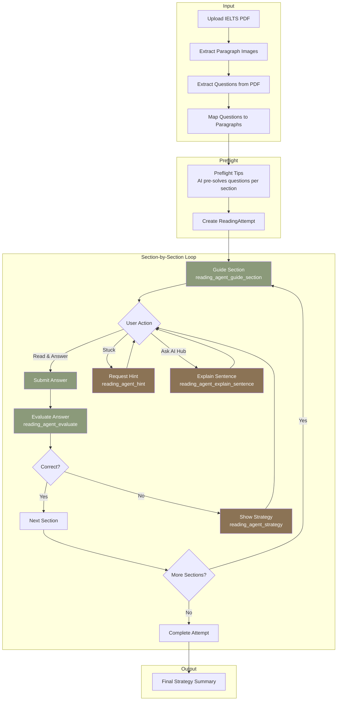
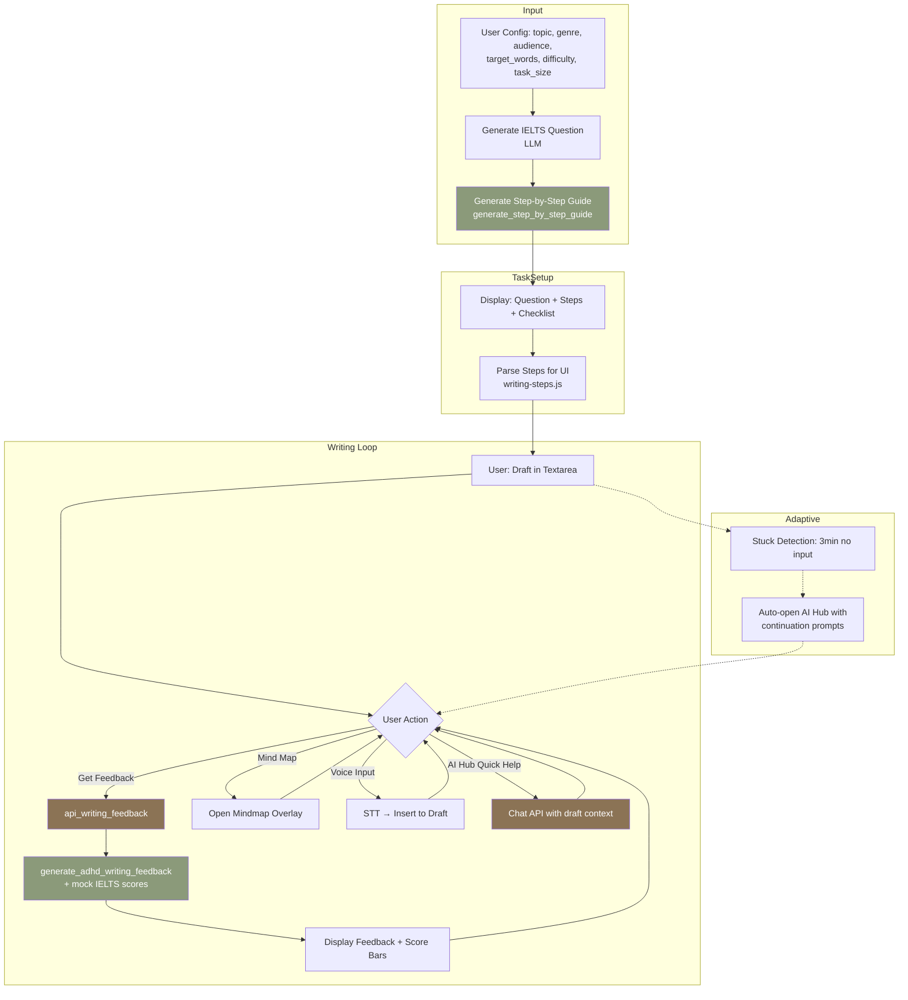

# EduwHealth 2.0 — Agent Workflow Charts

Mermaid diagrams for Reading, Writing, Speaking, and Listening agents.  
Render in [Mermaid Live Editor](https://mermaid.live/) or any Markdown viewer with Mermaid support.

---

## 1. Reading Agent Workflow



---

## 2. Writing Agent Workflow



---

## 3. Speaking Agent Workflow

```mermaid
flowchart TB
    subgraph Input
        A[User Config: topic, scenario,<br/>minutes, english_level] --> B[Generate ADHD Speaking Pack<br/>generate_adhd_speaking_pack]
    end

    subgraph PackOutput
        B --> C[Markdown Pack: 30s warm-up,<br/>1min intro, 90s topic,<br/>mini dialogue, retell template,<br/>rescue phrases]
        C --> D[Split into Parts by ## headers]
        D --> E[Display Part-by-Part with<br/>Prev / Next navigation]
    end

    subgraph PracticeLoop["Practice Loop"]
        E --> F{User Action}
        F -->|Send Text to Coach| G[api_speaking_chat]
        F -->|Next Part| H[Advance to next Part]
        F -->|AI Hub Float| I[Chat API with<br/>current Part as context]
        
        G --> J[speaking_coach_reply<br/>Micro feedback + Better version + Next prompt]
        J --> K[Append to Chat History]
        K --> F
        
        H --> E
        I --> F
    end

    subgraph Output
        J -.-> L[1) Micro feedback bullets<br/>2) Better version paragraph<br/>3) Next question]
    end

    style B fill:#e8796b,color:#fff
    style J fill:#e8796b,color:#fff
    style G fill:#d96a5c,color:#fff
    style I fill:#d96a5c,color:#fff
```

---

## 4. Listening Agent Workflow

```mermaid
flowchart TB
    subgraph Input
        A[User Config: scenario,<br/>environment, goal] --> B[Generate Listening Strategy<br/>generate_adhd_listening_strategy]
    end

    subgraph StrategyOutput
        B --> C[Markdown Strategy Cards<br/>## 0) 开始前... ## 1) 任务概览...<br/>## 2) 预热 ## 3) 听的过程中...<br/>## 4) 听完之后 ## 5) 自我倡导 ## 6) 结束语]
        C --> D[Split to Cards by ## headers]
        D --> E[Display Part-by-Part with<br/>Prev / Next + Dots]
    end

    subgraph AudioSection
        B --> F[Generate Sample Passage<br/>generate_sample_listening_passage]
        F --> G[Display Passage Text]
        G --> H[TTS Playback: 0.75x / 1x / 1.25x]
    end

    subgraph LogicChain
        H --> I{User Action}
        I -->|Generate Logic Chain| J[extract_logic_chain<br/>LLM extracts structure]
        J --> K[Display Logic Chain]
        K --> I
    end

    subgraph Navigation
        E --> I
        I -->|Prev/Next Card| E
    end

    style B fill:#7a9a8e,color:#fff
    style F fill:#7a9a8e,color:#fff
    style J fill:#6a8a7e,color:#fff
```

---

## Summary Table

| Agent   | Main Entry Points                    | Key Outputs                                      |
|---------|--------------------------------------|--------------------------------------------------|
| Reading | `api_reading_upload`, `api_reading_*` | Section guidance, hints, evaluation, strategy    |
| Writing | `api_writing_generate`, `api_writing_feedback` | Step guide, IELTS question, feedback, scores |
| Speaking| `api_speaking_generate`, `api_speaking_chat`   | Practice pack (parts), coach replies             |
| Listening| `api_listening_strategy`             | Strategy cards, sample passage, logic chain     |
